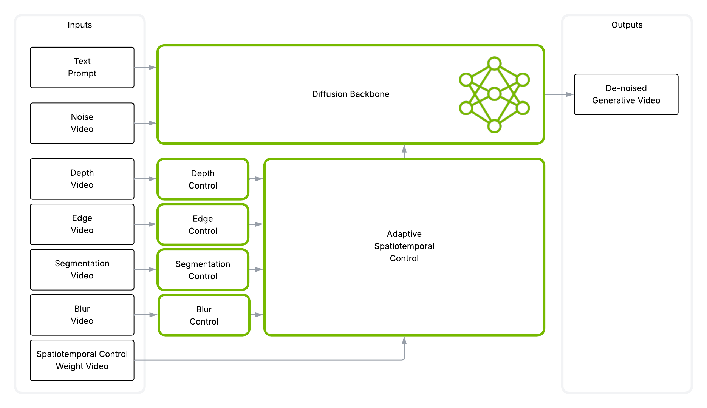

# Cosmos-Transfer2-2B: 適応型マルチモーダル制御による世界生成
このガイドでは、Cosmos-Transfer2.5（汎用モデル）で推論を実行する手順を説明します。



### 前提条件
1. 環境構築、チェックポイントのダウンロード、ハードウェア要件については [セットアップガイド](setup.md) に従ってください。

### ハードウェア要件

以下は、単一 GPU で推論する場合の Cosmos-Transfer2 各モデルの必要 GPU メモリです。

| モデル | 必要 GPU VRAM |
|-------|-------------------|
| Cosmos-Transfer2-2B | 65.4 GB |

### 推論パフォーマンス

以下は、単一 GPU 推論時の NVIDIA 各種 GPU における生成時間（*）です。

| GPU ハードウェア | Cosmos-Transfer2-2B（セグメンテーション） |
|--------------|---------------|
| NVIDIA B200 | 285.83 sec |
| NVIDIA H100 NVL | 719.4 sec |
| NVIDIA H100 PCIe | 870.3 sec |
| NVIDIA H20 | 2326.6 sec |

\* セグメンテーション制御入力、720P・16FPS・5秒（93 フレーム）の動画で計測。

## 事前学習済み Cosmos-Transfer2 モデルでの推論

各種コントロールのバリアントは単一 GPU で実行できます:
```bash
python examples/inference.py --params_file assets/robot_example/depth/robot_depth_spec.json
```

単一のコントロールでマルチ GPU 推論する、または複数のコントロールを同時に実行する場合は [torchrun](https://docs.pytorch.org/docs/stable/elastic/run.html) を使用します:
```bash
export NUM_GPUS=8
torchrun --nproc_per_node=$NUM_GPUS --master_port=12341 -m examples.inference --params_file assets/robot_example/vis/robot_vis_spec.json --num_gpus=$NUM_GPUS
```

各コントロールのバリアントおよびマルチコントロールの例として、以下のパラメータファイルを用意しています:

| バリアント | パラメータファイル |
| --- | --- |
| Depth | `assets/robot_example/depth/robot_depth_spec.json` |
| Edge | `assets/robot_example/edge/robot_edge_spec.json` |
| Segmentation | `assets/robot_example/seg/robot_seg_spec.json` |
| Blur | `assets/robot_example/vis/robot_vis_spec.json` |
| Multi-control | `assets/robot_example/multicontrol/robot_multicontrol_spec.json` |

パラメータは JSON で指定できます:

```jsonc
{
    // プロンプトファイルへのパス。"prompt" で文字列として直接指定も可能
    "prompt_path": "assets/robot_example/robot_prompt.json",

    // 生成動画の保存先ディレクトリ
    "output_dir": "outputs/robot_multicontrol",

    // 入力動画のパス
    "video_path": "assets/robot_example/robot_input.mp4",

    // 推論設定
    "guidance": 3,

    // Depth 制御の設定
    "depth": {
        // 制御動画のパス
        // "vis" と "edge" は、制御を与えない場合は実行時に自動計算されます
        "control_path": "assets/robot_example/depth/robot_depth.mp4",

        // Depth 制御の重み
        "control_weight": 0.5
    },

    // Edge 制御の設定
    "edge": {
        // 制御動画のパス
        "control_path": "assets/robot_example/edge/robot_edge.mp4",
        // Edge 制御のデフォルト重みは 1.0
    },

    // Seg 制御の設定
    "seg": {
        // 制御動画のパス
        "control_path": "assets/robot_example/seg/robot_seg.mp4",

        // Seg 制御の重み
        "control_weight": 1.0
    },

    // Blur（vis）制御の設定
    "vis":{
        // 制御動画は実行時に自動計算
        "control_weight": 0.5
    }
}
```

## 出力

### マルチコントロール

https://github.com/user-attachments/assets/337127b2-9c4e-4294-b82d-c89cdebfbe1d
