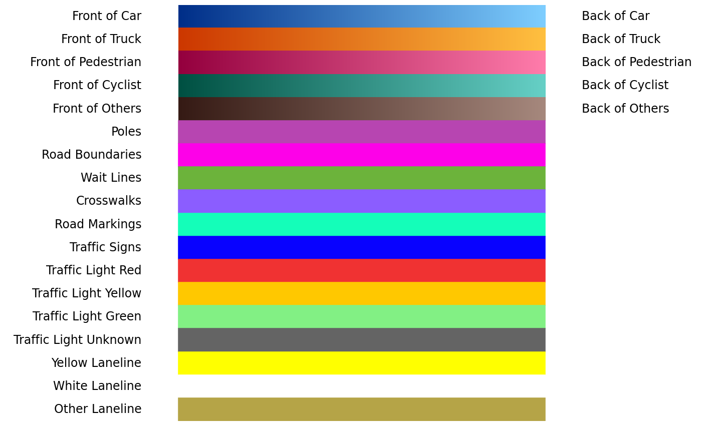
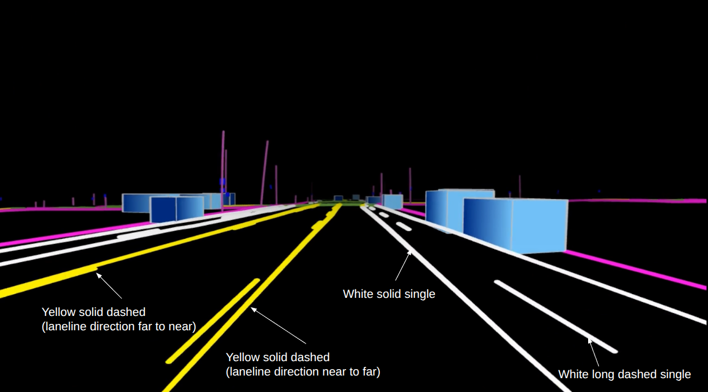
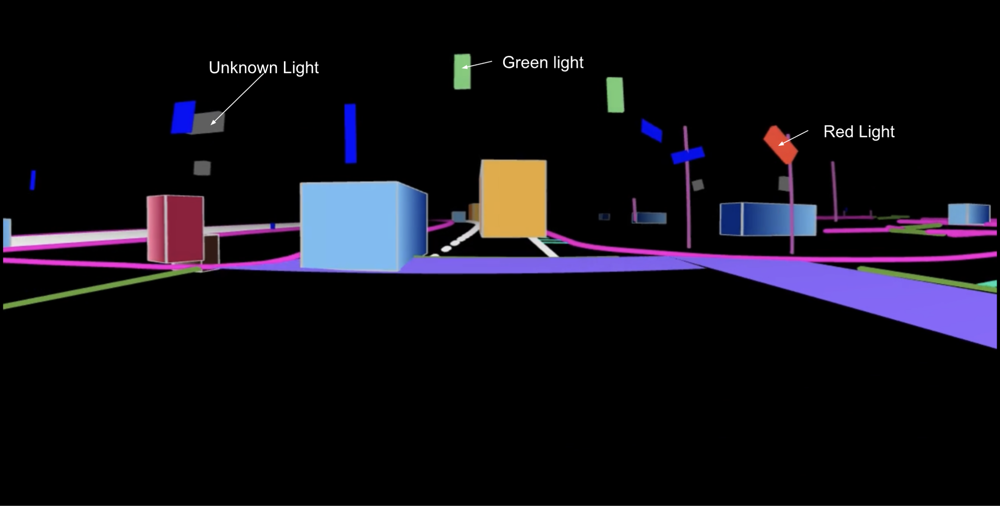

# World Scenario Video Generation

This tool generates control videos from 3D scene annotations for Cosmos Transfer2.5. It renders RDS-HQ world models into videos by projecting polylines, polygons, and cuboids onto camera views.

## Table of Contents

<!--TOC-->

- [Table of Contents](#table-of-contents)
- [Getting Started](#getting-started)
  - [Requirements](#requirements)
  - [Setup](#setup)
  - [Quick Start](#quick-start)
  - [Complete Example](#complete-example)
- [Usage](#usage)
  - [Basic Commands](#basic-commands)
  - [Options](#options)
  - [Available Cameras](#available-cameras)
- [Data Format](#data-format)
  - [Input Structure](#input-structure)
  - [Output Structure](#output-structure)
- [What Gets Rendered](#what-gets-rendered)
- [Troubleshooting](#troubleshooting)
  - [Common Issues](#common-issues)
- [Integration](#integration)
- [Rendering Specifications](#rendering-specifications)
  - [Color Palette](#color-palette)
  - [Dynamic Objects](#dynamic-objects)
  - [Lanelines](#lanelines)
  - [Traffic Lights](#traffic-lights)
  - [Map Elements](#map-elements)

<!--TOC-->

---

## Getting Started

### Requirements

- Python 3.10+
- UV (for dependency management)
- GPU with EGL support (for headless OpenGL rendering)
- 3D scene annotation data in parquet format

### Setup

First, set up your environment:

```bash
uv sync
source .venv/bin/activate  # On Windows: .venv\Scripts\activate
```

### Quick Start

Generate world scenario videos from your 3D scene annotations:

```bash
python scripts/generate_control_videos.py /path/to/{input_root} /path/to/{save_root}
```

### Complete Example

Here's a full working example you can copy and paste to try it out:

```bash
# Download example data
cd assets
wget https://github.com/nvidia-cosmos/cosmos-dependencies/releases/download/assets/multiview_example1.zip
unzip multiview_example1.zip
cd ..

# Generate control videos for the example scene
python scripts/generate_control_videos.py assets/multiview_example1/scene_annotations outputs/multiview_example1_world_scenario_videos
```

Examples you can download:
```bash
wget https://github.com/nvidia-cosmos/cosmos-dependencies/releases/download/assets/multiview_example1.zip
wget https://github.com/nvidia-cosmos/cosmos-dependencies/releases/download/assets/multiview_example2.zip
wget https://github.com/nvidia-cosmos/cosmos-dependencies/releases/download/assets/multiview_example3.zip
```

## Usage

### Basic Commands

```bash
# All cameras (default)
python scripts/generate_control_videos.py {input_root}/ {save_root}/

# Specific cameras
python scripts/generate_control_videos.py {input_root}/ {save_root}/ \
    --cameras "camera:front:wide:120fov,camera:cross:right:120fov"
```

### Options

| Option | Default | Description |
|--------|---------|-------------|
| `--cameras` | `all` | Camera names or "all" for all 7 cameras |

### Available Cameras

- `camera:front:wide:120fov`
- `camera:front:tele:sat:30fov`
- `camera:cross:right:120fov`
- `camera:cross:left:120fov`
- `camera:rear:left:70fov`
- `camera:rear:right:70fov`
- `camera:rear:tele:30fov`

## Data Format

### Input Structure
```
scene_annotations_directory/
├── uuid.obstacle.parquet              (required)
├── uuid.calibration_estimate.parquet  (required)
├── uuid.egomotion_estimate.parquet    (required)
├── uuid.lane.parquet                  (optional)
├── uuid.lane_line.parquet             (optional)
└── ... (other optional parquet files)
```

See [World Scenario Parquet File Structure](world_scenario_parquet.md) for more details.

### Output Structure
```
save_root/
└── uuid/
    ├── uuid.camera_front_wide_120fov.mp4
    ├── uuid.camera_front_tele_sat_30fov.mp4
    ├── uuid.camera_cross_right_120fov.mp4
    ├── uuid.camera_cross_left_120fov.mp4
    ├── uuid.camera_rear_left_70fov.mp4
    ├── uuid.camera_rear_right_70fov.mp4
    ├── uuid.camera_rear_tele_30fov.mp4
```

## What Gets Rendered

**Always rendered:** 3D bounding boxes for vehicles/pedestrians (from required `obstacle.parquet`)

**Optionally rendered** (only if corresponding parquet file provided):
- Lane lines, lanes, road boundaries
- Crosswalks, poles, road markings, wait lines
- Traffic lights and signs

## Troubleshooting

### Common Issues

| Issue | Solution |
|-------|----------|
| **ModernGL/EGL errors** | Install GPU drivers and EGL libraries. Ubuntu/Debian: `apt install libegl1-mesa-dev libgl1-mesa-dri` |
| **Missing parquet files** | Ensure required files exist: `obstacle`, `calibration_estimate`, `egomotion_estimate` |
| **Memory issues** | Process fewer cameras at once |
| **Invalid camera names** | Run with `--help` to see valid options |

## Integration

Generated control videos serve as conditioning inputs for Cosmos Transfer2.5 model inference. The HD map visualizations provide spatial context for video generation tasks.

## Rendering Specifications

This specification enhances [Cosmos Drive Dreams](https://github.com/nv-tlabs/Cosmos-Drive-Dreams) v1 with lane line types and traffic light states, including: Dynamic Objects, Lanelines, Traffic Lights, and Map Elements.

<p align="center">
  
</p>

<p align="center">
  
</p>

### Color Palette

<p align="center">
  
</p>

### Dynamic Objects
**Config:** [config_color_bbox.json](https://github.com/nvidia-cosmos/cosmos-transfer2.5/blob/c4d0517fdffaabcf8346956c910bfcbd941dbddf/scripts/av_utils/color_configs/config_color_bbox.json#L16-L21)

Dynamic objects are solid cuboids with light gray edges and front-to-back gradients.

**Label Mapping:** [bbox_utils.py](https://github.com/nvidia-cosmos/cosmos-transfer2.5/blob/c4d0517fdffaabcf8346956c910bfcbd941dbddf/scripts/av_utils/bbox_utils.py#L52-L80) maps the following DCP labels to the five categories:
1. **Car**: automobile, other_vehicle, vehicle
2. **Truck**: heavy_truck, bus, train_or_tram_car, trailer
3. **Pedestrian**: person
4. **Cyclist**: rider
5. **Others**: protruding_object, animal, stroller

<p align="center">
  
</p>

### Lanelines
**Config:** [config_color_geometry_laneline.json](https://github.com/nvidia-cosmos/cosmos-transfer2.5/blob/c4d0517fdffaabcf8346956c910bfcbd941dbddf/scripts/av_utils/color_configs/config_color_geometry_laneline.json)

Lanelines are categorized into 15 types with combinations of:
- **Colors:** yellow, white, other
- **Styles:** solid, dashed, dotted

**Subtypes:** solid single, solid group (double), solid dashed, dashed solid, long dashed single, etc.

_Example: `yellow solid dashed` = yellow solid line (right) + yellow dashed line (left) in polyline direction._

<p align="center">
  
</p>

### Traffic Lights
**Config:** [config_color_traffic_light.json](https://github.com/nvidia-cosmos/cosmos-transfer2.5/blob/c4d0517fdffaabcf8346956c910bfcbd941dbddf/scripts/av_utils/color_configs/config_color_traffic_light.json)

Traffic lights are rendered as cuboids with four states: Red, Yellow, Green, Unknown.

<p align="center">
  
</p>

### Map Elements
**Config:** [config_color_hdmap.json](https://github.com/nvidia-cosmos/cosmos-transfer2.5/blob/c4d0517fdffaabcf8346956c910bfcbd941dbddf/scripts/av_utils/color_configs/config_color_hdmap.json)

Map elements are rendered into three geometry types: **Polylines** (poles, boundaries, wait lines), **Polygons** (crosswalks, markings), **Cuboids** (signs).

<p align="center">
  
</p>

## Pipeline Overview

### Frame Rate Configuration

The rendering pipeline uses two configurable frame rates (defined in `scripts/av_utils/render_config.py`):
- **`INPUT_POSE_FPS`** (default: 30): Processing frame rate for interpolation - determines how many frames are generated
- **`TARGET_RENDER_FPS`** (default: 30): Output video frame rate - determines playback speed

Common source data rates:
- **`SOURCE_POSE_FPS`**: 10Hz (ego motion in parquet files)
- **`SOURCE_OBSTACLE_FPS`**: 10Hz (obstacle data in parquet files)

### 1. Interpolation
- **Obstacle data**: Interpolated from source frequency (typically 10Hz) to processing frame rate (default: 30 fps, configurable via `INPUT_POSE_FPS` in `scripts/av_utils/render_config.py`)
- **Egomotion data**: Interpolated to same processing frame rate (default: 30 fps, using `INPUT_POSE_FPS`)
- **Map data**: Static elements loaded once (no interpolation needed)
- **Note**: The processing frame rate (`INPUT_POSE_FPS`) determines the temporal resolution for rendering. The output video frame rate (`TARGET_RENDER_FPS`) is separate and typically matches the processing rate.

### 2. Coordinate Systems
- **World coordinates**: Right-handed coordinate system (x=forward, y=left, z=up)
- **Camera coordinates**: Converted to camera coordinate system where:
  - x-axis points right
  - y-axis points down
  - z-axis points forward (into the scene)
  - This follows the convention where the camera looks along the positive z-axis
- **FLU convention**: Forward-Left-Up used internally

### 3. Rendering Process
1. Load camera calibration
2. Parse egomotion trajectory and interpolate to processing frame rate
3. Interpolate obstacle tracks to match ego timestamps
4. Transform all geometries to camera view
5. Render
6. Output as MP4 video files
